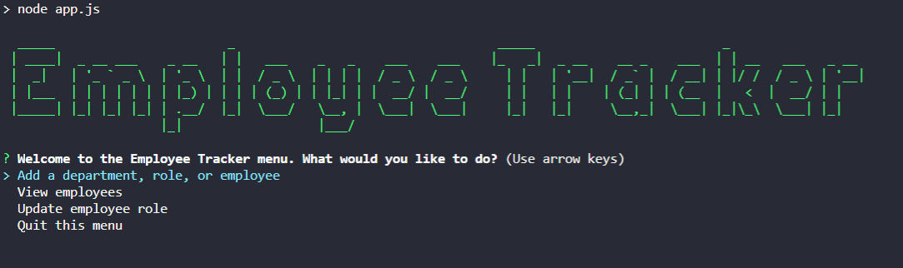

# Employee Tracker

## Description
    A CLI Content Management System for tracking company employees, departments, and department positions. 
    
## Table of Contents 
1. [Installation](#installation)
2. [Usage](#usage)
3. [Technologies](#technologies)
4. [Demo](#demo)
5. [License](#license)
6. [Contributing](#contributing)
7. [Tests](#tests)
8. [Questions](#questions)
    
## Installation
Install dependencies and run the start script, `npm start`

## Usage
Navigate the menu and enter new data in your terminal. 

## Technologies
Node.js and MySQL

## Demo

    

## License 
  
Copyright (c) 2020 Rudi Kraeher
    
## Contributing
If you want to reach me please email.
    
## Tests
No testing guidelines at this time.
    
## Questions
If you have any questions about the repo you can email me at rudikraeher@gmail.com.  
Visit my [GitHub](https://github.com/rkraeher) to see more of my work.